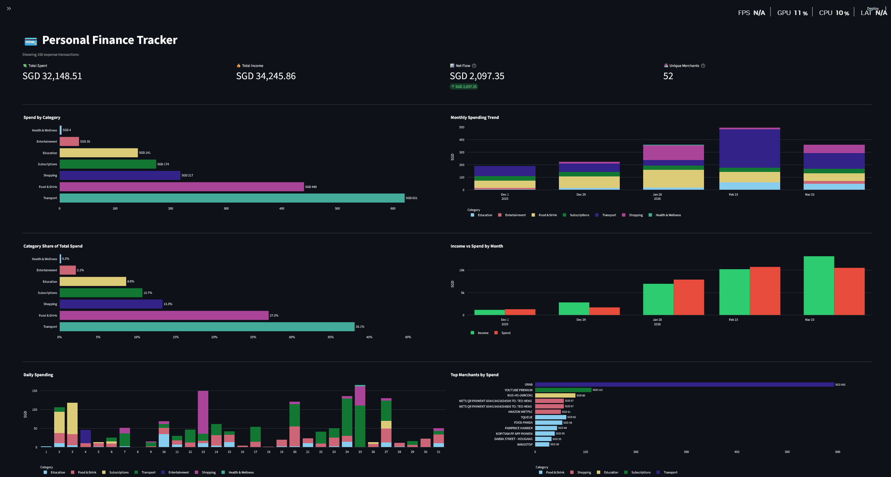
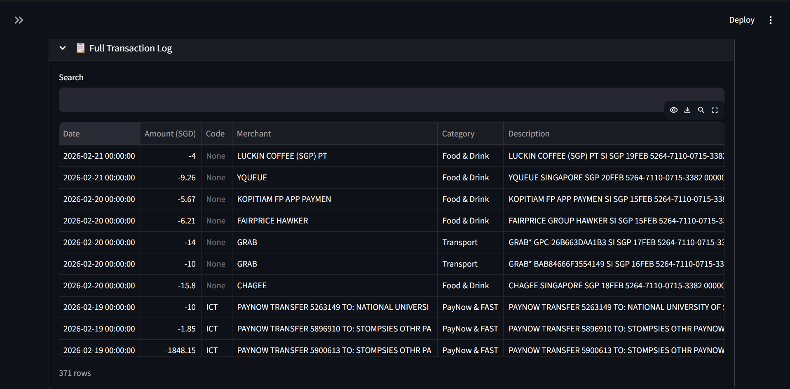

# 💳 Personal Finance Tracker

> A local, automated data pipeline and interactive dashboard for tracking and analysing DBS/POSB bank transactions — built with Python, Pandas, SQLite, and Streamlit.



---

## The Problem

DBS iBanking exports are raw, noisy CSV files. Every card transaction description looks like this:

```
GRAB* GPC-3140FD79BA09 SI SGP 25MAR 5264-7110-0715-3382 0000
```

Manually cleaning, deduplicating, and categorising months of transactions is tedious, error-prone, and doesn't scale. Existing budgeting apps either require sharing your banking credentials or don't support local Singapore bank formats.

---

## The Solution

A fully local, privacy-first pipeline that:

1. **Ingests** your raw DBS CSV export
2. **Cleans** terminal noise, hex codes, and card reference numbers via regex
3. **Categorises** every transaction using a 5-tier confidence system
4. **Stores** everything in a normalised SQLite database
5. **Visualises** your spending in an interactive Streamlit dashboard
6. **Sets and tracks** monthly budget limits via an interactive UI that writes directly to the SQLite database

No cloud. No credentials shared. Your data never leaves your machine.

---

## Architecture

### Extract & Transform (`core/transformer.py`)

Raw DBS descriptions contain significant terminal noise. The transformer strips it systematically before any categorisation occurs:

| Raw DBS Description                                       | After Cleaning    |
| --------------------------------------------------------- | ----------------- |
| `GRAB* GPC-3140FD79BA09 SI SGP 25MAR 5264-7110-0715-3382` | `GRAB`            |
| `GOOGLE*YOUTUBEPREMIUM G. SGP 30NOV 5264-7110-0715-3382`  | `YOUTUBE PREMIUM` |
| `FP*FOOD PANDA SINGAPORE SGP 22APR 5264-7110-0715-3382`   | `FOOD PANDA`      |
| `AMZNPRIMESG MEMBERSHI SI SGP 22APR 5264-7110-0715-3382`  | `AMAZON PRIME`    |

Cleaning pipeline (applied in order):

- Strip country-code terminal suffix: `SI SGP 25MAR 5264-...` → gone
- Strip `GPC-XXXXXXXXXX` terminal reference codes
- Strip standalone hex blobs (8+ hex characters)
- Replace `*` with space (`GOOGLE*YOUTUBE` → `GOOGLE YOUTUBE`)
- Strip `FP` prefix (FoodPanda transactions)
- Strip trailing lone initials (`G.`) and country suffixes (`SG`)
- Apply canonical alias map (`FAIRPRICE XTRA` → `FAIRPRICE`)

Each transaction also receives a SHA-256 deduplication hash so re-importing the same CSV never creates duplicate rows.

---

### The Categorisation Engine (`core/categoriser.py`)

A 5-tier confidence system assigns every transaction a budget category. Higher tiers take precedence over lower ones:

| Tier   | Signal                           | Example                                                |
| ------ | -------------------------------- | ------------------------------------------------------ |
| **1a** | Cash withdrawal code             | `AWL`, `WDL`, `ATM` → `Cash Withdrawals`               |
| **1b** | Bidirectional code + amount sign | `ICT` positive → `Income` / negative → `PayNow & FAST` |
| **2**  | High-signal DBS transaction code | `IBG` salary credit → `Income`                         |
| **3**  | Merchant keyword match           | `"spotify"` in description → `Subscriptions`           |
| **4**  | Generic code fallback            | `POS` at unknown merchant → `Shopping`                 |
| **5**  | Default                          | → `Uncategorised`                                      |

The engine is seeded with all **814 official DBS/POSB transaction codes**, cross-referenced against a custom keyword map of 80+ Singapore merchants across 12 categories.

**Why no bare `"grab"` keyword?** DBS uses identical description formats for both GrabFood and Grab rides (`GRAB* GPC-XXXXXXXXX SI SGP`). A bare substring match would incorrectly collapse both into one category. The engine instead treats unresolvable ambiguous transactions as `Transport` (the safer default) while preserving `"grab food"` and `"grabfood"` as specific Food & Drink matches.

---

### Load & Store (`core/loader.py` + `core/schema.sql`)

Data is stored in a **Third Normal Form (3NF)** SQLite schema:

```
Categories ──< Merchants ──< Transactions >── TransactionCodes
```

- `Categories` — budget categories (Food & Drink, Transport, etc.)
- `Merchants` — canonical merchant names, each linked to one category
- `TransactionCodes` — all 814 DBS codes with their category mappings
- `Transactions` — one row per transaction, with a `UNIQUE` hash constraint
- `v_transactions_full` — pre-joined view for dashboard queries

---

### Visualise (`app.py` + `dashboard/`)

The dashboard package is fully modular — each file has a single responsibility:

```
dashboard/
├── data.py      # All DB queries and DataFrame aggregations
├── filters.py   # Sidebar UI → FilterState dataclass
├── charts.py    # Pure functions: DataFrame in, Plotly figure out
├── kpis.py      # KPI metric row
└── tables.py    # Transaction log and uncategorised review
```

`app.py` is the orchestrator — it wires the modules together with no business logic of its own.



---

## Tech Stack

| Layer                     | Technology                                  |
| ------------------------- | ------------------------------------------- |
| Data ingestion & cleaning | Python 3.11, Pandas                         |
| Storage                   | SQLite (via `sqlite3`)                      |
| Categorisation            | Python (regex, dict-based keyword matching) |
| Visualisation             | Streamlit, Plotly                           |
| Version control           | Git / GitHub                                |

---

## Quickstart

### 1. Clone the repository

```bash
git clone https://github.com/YOUR_USERNAME/Personal-Finance-Tracker-2026.git
cd Personal-Finance-Tracker-2026
```

### 2. Create and activate a virtual environment

```bash
# Windows
python -m venv venv
venv\Scripts\activate

# macOS / Linux
python -m venv venv
source venv/bin/activate
```

### 3. Install dependencies

```bash
pip install -r requirements.txt
```

### 4. Add your bank export

Download from DBS iBanking:

> **My Accounts → Transaction History → Download → CSV**

⚠️ Always choose **CSV** format — the Excel export omits the `Transaction Code` column, which the categorisation engine depends on.

Save as `bank_export.csv` in the project root. See `bank_export_sample.csv` for the expected column format:

```
Transaction Date, Description, Withdrawal Amount, Deposit Amount, Transaction Code
```

### 5. Run the ETL pipeline

```bash
# First run — builds the database from scratch
python etl.py --csv bank_export.csv --reset

# Subsequent runs — appends new transactions, skips duplicates
python etl.py --csv bank_export.csv
```

### 6. Launch the dashboard

```bash
streamlit run app.py
```

---

## Project Structure

```
PersonalFinanceProject/
│
├── core/                               # Shared business logic
│   ├── categoriser.py                  # 5-tier confidence system + 80+ keyword map
│   ├── transformer.py                  # Regex cleaning, date parsing, hash generation
│   ├── loader.py                       # Schema init, code seeding, dedup insertion
│   └── schema.sql                      # SQLite DDL (tables, indexes, view)
│
├── dashboard/                          # Modular dashboard package
│   ├── data.py                         # DB queries and aggregations
│   ├── filters.py                      # Sidebar → FilterState
│   ├── charts.py                       # Pure Plotly figure factory
│   ├── kpis.py                         # KPI metric row
│   └── tables.py                       # Transaction log + uncategorised review
│
├── assets/                             # Screenshots for README
│
├── app.py                              # Streamlit dashboard entry point
├── etl.py                              # CLI pipeline entry point
├── transaction_codes_loader.py         # DBS code reference seeder
├── diagnose.py                         # Data quality audit tool
│
├── DBS Transaction Codes & Descriptions.txt
├── bank_export_sample.csv
├── requirements.txt
├── MILESTONES.md
└── README.md
```

---

## Privacy

Your financial data is **never committed to this repository**. The `.gitignore` excludes:

```
bank_export.csv    # your real transaction data
*.csv              # any CSV that might contain transaction data
finance.db         # the SQLite database
.env               # secrets and API keys
```

---

## Roadmap

See [MILESTONES.md](MILESTONES.md) for the full project roadmap and current progress.

---

## Requirements

- Python 3.11+
- `pandas >= 2.0`
- `streamlit >= 1.35`
- `plotly >= 5.0`
